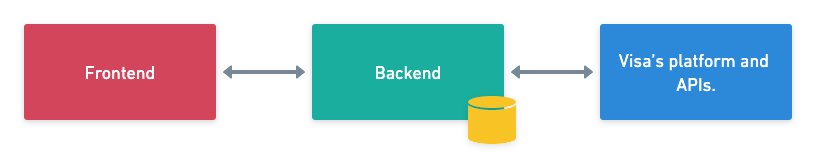

# Projeto Exchange Rate (Visa)

Esse documento descreve o sistema criado com o objetivo de estudos da plataforma [Visa Developer](https://developer.visa.com/), com a implementação dos softwares **Frontend** e **Backend** para consumo das APIs da Visa.

A ideia da aplicação é integrar o **Backend** com a plataforma Visa, onde temos várias possibilidades de integrações. A lista completa das integrações da Visa disponíveis estão [neste link](https://developer.visa.com/apibrowser). A API escolhida para integração foi a de _Foreign Exchange Rates_, com a documentação disponível [neste link](https://developer.visa.com/capabilities/foreign_exchange). 

Apesar da API escolhida ser relativamente simples, habilitou-se a base para que que outras APIs possam ser integradas ao sistema, caso necessário. Com isso, a utilização da encriptação de canal [Mutual Authentication (Two Way Authentication)](https://developer.visa.com/pages/working-with-visa-apis/two-way-ssl), configuração do projeto na plataforma e autenticação são comuns para o uso em todas as APIs disponíveis na Visa.

A implementação contempla os softwares **Backend** e **Frontend**, junto com a modelagem do banco de dados e a integração com a plataforma da Visa, com dois objetivos básicos:

1) Permitir o cálculo de conversão entre moedas com a cotação atual Visa;
2) Armazenagem e utilização do histórico da taxa de conversão da moeda na Visa, para construção de um gráfico.

# Visão geral do sistema
O objetivo desse tópico é apresentar as partes principais da arquitetura resumidamente. A figura abaixo descreve a integração entre os componentes de software.

&nbsp;



&nbsp;

De acordo com a figura, temos dois softwares criados para essa arquitetura e uma integração com a plataforma da Visa.

1) O **Frontend** é responsável por realizar as chamadas HTTP para o backend, apresentar os dados de maneira fácil e intuitiva para o usuário. Foram utizados as seguintes tecnologias para a sua construção:
- Construído no frameword Angular 15;
- Linguagem TypeScript, CSS e HTML;
- Material Design;
- Formulário Reativo;
- Gráfico ApexCharts;
- Testes unitários planejados a desenvolver.
2) O **Backend** é o responsável por orquestrar os dados que o **Frontend** necessita, gerencia as regras de negócios, acesso ao banco de dados e integrações:
- Construído no frameword SpringBoot;
- Linguagem Kotlin / Java;
- Integração com a plataforma da Visa e consumo de API Visa;
- Encriptação de canal de comunicação via Mutual Authentication ou também chamado de mTLS;
- Banco de dados H2;
- Modelagem da informação;
- Serviços RESTFul;
- Aplicação com timezone UTC;
- SQL e JPA;
- Testes unitários planejados a desenvolver.
3) A **integração com a Visa** é plataforma que disponibiliza as APIs da Visa, que foi integrada ao **Backend**, para realizar operações de consultas de câmbio de moedas.


# Resumo da API

Os dois endpoints principais que compõem a API são:

1) O endpoint **Get "/rate"**, que realiza a conversão de moedas;
2) O endpoint **Get "/rates"**, que retorna uma lista de taxa de conversão de uma moeda de origem para a moeda destino.

#### Softwares Utilizados para o Desenvolvimento
- IDE Visual Studio Code na última versão disponível;
- IDE IntelliJ IDEA CE na última versão disponível;
- NodeJS versão 18;
- Java versão 19;
- GIT na última versão disponível.

# Passos para execução do ambiente

1) Criar uma conta na [Visa Developer](https://developer.visa.com/) e seguir os passos para ativação do serviço de _Foreign Exchange Rates_, documentação:
- https://developer.visa.com/pages/working-with-visa-apis/create-project
- Alterar as credenciais no arquivo application.properties do projeto:
```
### VISA ####
app.visa.keystorePath = /Visa/myProject_keyAndCertBundle.jks (Modificar)
app.visa.keystorePassword = XXXXXXX  (Modificar)
app.visa.userId = SAWGRQTSGSG234#aSFDSFASDFDSAASFDAFASD#SASDA   (Modificar)
app.visa.password = IAasdSAFFSAD   (Modificar)
app.visa.server.url = https://sandbox.api.visa.com
```

2) Executar o **Backend** de acordo com os artigos:
- https://spring.io/guides/gs/spring-boot/
- https://www.jetbrains.com/help/idea/spring-boot.html

3) Executar o **Frontend** de acordo com o artigo:
- https://angular.io/start/start-deployment
 

# Video do Projeto em Execução
[](https://youtu.be/P6fNIOwuRL0 "Vídeo do Projeto Pessoal Exchange")
https://youtu.be/P6fNIOwuRL0
